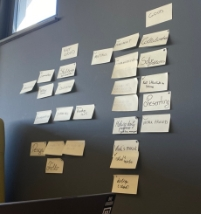

### *Breda University of Applied Sciences*
## *GeoNinjas:*
- ### *Wojciech Stachowiak(222679)*
- ### *Bogdan Matache(225108)*
- ### *Thijn van Oort(212396)*
- ### *Panna Pfandler(225928)*
#### *23/06/2023*
## Introduction
## Overview
The project aims to utilize comprehensive data analysis to create a better living environment in Breda. By leveraging datasets provided by the municipality like green-index and livability score, publicly available police data on crimes and nuisances, as well as data on amenities and housing prices, our project focuses on four main goals. Firstly, we aim to provide recommendations for improving different neighborhoods within Breda by identifying areas that require attention and proposing targeted initiatives. Furthermore, we seek to assist individuals and families in finding suitable neighborhoods based on their specific requirements and preferences. Thirdly, we aim to reduce crime rates by analyzing crime data and developing effective strategies tailored to different types of crimes. Lastly, we aim to understand the factors that influence house prices in order to provide insights that inform decision-making in the real estate market. Through these goals, our project aims to enhance the overall livability, safety, and prosperity of Breda, making it an even better place to live, work, and thrive.
## The project impact
The project can have a significant impact on various stakeholders within the city of Breda. Here are some of the key groups that might be affected by the project:

- **Residents:** The primary beneficiaries of the project are the residents of Breda. The project's recommendations for improving neighborhoods, enhancing safety, and providing personalized recommendations for suitable living environments can directly impact the quality of life and well-being of residents.
- **Local Authorities and Policymakers:** The project's findings and recommendations can influence the decisions and actions of local authorities and policymakers. The insights gained from data analysis can inform urban planning, resource allocation, and policy development, enabling more effective and targeted interventions to enhance livability and safety in the city.
- **Real Estate Industry Professionals:** Professionals working in the real estate industry, such as real estate agents, developers, and investors, can be affected by the project. The analysis of factors influencing house prices and the availability of comprehensive neighborhood data can provide valuable insights for their decision-making processes.
- **Community Organizations:** Community organizations involved in neighborhood development, social initiatives, or advocacy work can be impacted by the project. The project's recommendations for neighborhood improvements and safety measures can align with the goals and objectives of these organizations, fostering collaboration and collective efforts towards enhancing the community.
- **Visitors and Tourists:** The project's focus on enhancing livability and safety can also have an indirect impact on visitors and tourists to Breda. The improvement of neighborhoods, public safety measures, and the overall attractiveness of the city can contribute to a positive visitor experience, potentially boosting tourism and economic growth.
## Benefits of the project
**Improved Livability:** By providing recommendations to enhance different neighborhoods, the project aims to improve the quality of life for residents. This can involve initiatives such as creating more parks, enhancing safety measures, and addressing specific neighborhood needs. Ultimately, the project aims to create more livable and attractive neighborhoods for residents to enjoy.

**Enhanced Safety:** The project's analysis of crime rates and nuisances aims to develop targeted strategies for reducing different types of crimes. By understanding patterns and underlying causes, effective measures can be implemented to improve public safety. This contributes to creating a safer environment for residents and visitors alike.

**Informed Decision-Making:** The project's analysis of factors influencing house prices and amenities can provide valuable insights to buyers, sellers, and real estate professionals. Understanding these factors allows for more informed decision-making in the real estate market, promoting transparency and efficiency. This benefits individuals and stakeholders involved in buying, selling, and investing in properties in Breda.

**Tailored Recommendations:** Through the project's analysis, residents can benefit from personalized recommendations for finding suitable neighborhoods based on their specific requirements and preferences. This helps individuals and families make informed choices about where to live, considering factors such as safety, amenities, and overall quality of life.

**Data-Driven Decision-Making:** The project demonstrates the power of data analytics in driving decision-making processes. By utilizing comprehensive datasets, the project provides evidence-based insights, enabling policymakers and stakeholders to make informed decisions and allocate resources effectively.
## Concerns about the project:
While the project aims to bring about positive changes, there are several potential problems or concerns that might arise. It is important to address these proactively to ensure the project's success and mitigate any negative consequences. Some potential problems and concerns include:

**Bias and Discrimination:** Data analysis and decision-making processes must be carefully monitored to prevent biases from influencing the results or recommendations. Unintentional bias in the data or algorithms used for analysis could result in discriminatory outcomes or reinforce existing inequalities within neighborhoods. Regular audits and checks for bias, along with transparency in the methodology, can help mitigate these concerns.

**Ethical Use of Data:** The project's use of data must adhere to ethical guidelines and principles. This includes obtaining appropriate permissions (maybe: legally acquired) for data usage, ensuring data accuracy and integrity, and being transparent about the project's intentions and potential outcomes. Safeguarding against potential misuse or unintended consequences is critical to maintaining public trust.

**Missing Data:** One of the challenges that may arise during the project is the presence of missing data within the datasets utilized. Missing data can potentially impact the accuracy and reliability of the analysis and subsequent recommendations. It is crucial to address this issue effectively to ensure the integrity of the project's findings.

## Important ethical aspects
## Algorithms
Our team employed the Random Forest algorithm to predict house prices, a powerful machine learning technique, and conducted extensive hyperparameter tuning to optimize its performance. Random Forest is a machine learning technique that combines multiple decision trees to generate predictions. Each decision tree is built using a randomly selected subset of the training data and features. During the training process, the algorithm constructs a set of decision trees by partitioning the data based on different features and thresholds. Individual trees make independent predictions, and the final prediction is obtained by aggregating the predictions from all the trees.
## Our team members are well-equipped to provide accessible explanations of the Random Forest algorithm. We understand the importance of communicating complex concepts in a clear and understandable manner, avoiding technical jargon and complexities. We can effectively explain how the algorithm works, its relevance to predicting house prices, and address any questions from a non-technical audience.
## Source
## Datasets:
- utils.geojson(Merged Dataset):
  - population.csv [Source](https://allcharts.info/the-netherlands/municipality-breda/)
  - lighting.geojson [Source](https://data.breda.nl/datasets/Breda::openbare-verlichting/explore?location=51.560642%2C4.774393%2C12.74)
  - work\_locations.geojson [Source](https://data.breda.nl/datasets/Breda::werklocaties/explore?location=51.557428%2C4.771700%2C12.80)
  - sport\_buildings.geojson [Source](https://data.breda.nl/datasets/Breda::sportaccomodaties/explore?location=51.574031%2C4.776141%2C13.16)
  - Buurten.geojson [Source](https://data.breda.nl/datasets/Breda::buurten/explore?location=51.564294%2C4.764872%2C12.31)
- jobs\_by\_buurt.csv(Merged:'population.csv' and 'Buurten.geojson')
- neighbourhood\_index.csv(Merged)
  - livability\_score.csv(Provided by municipality of Breda)
  - green\_score.csv(Provided by municipality of Breda)
- nuisance.csv [Source](https://data.politie.nl/#/Politie/nl/dataset/47024NED/table?ts=1685526475975)
- crime\_by\_type.csv [Source](https://data.politie.nl/#/Politie/nl/dataset/47018NED/table?ts=1685526622753)
- drugchords.csv [Source](https://www.google.com/maps?hl=en&q=alchol+store)
## Quality of Data
The datasets used in this project are sourced from reliable and official websites such as the municipality of Breda and the Dutch police. The datasets for lighting, work locations, sport buildings, and neighborhoods are obtained from the municipality of Breda's website, which is a trustworthy source. As they are official sources, the data's accuracy and reliability can be assumed. (lighting.geojson, work\_locations.geojson, sport\_buildings.geojson, Buurten.geojson, jobs\_by\_buurt.csv)

The dataset for the neighborhood index is extracted from the SQL server of the municipality of Breda. This database is a reliable reference for this type of data, and its accuracy and reliability can be expected. (livability\_score.csv, green\_score.csv)

The datasets for nuisance and crime by type utilized in this project are sourced from the Dutch police website, which is widely recognized as a reputable and authoritative source of crime data in the Netherlands. The Dutch police maintain robust data collection and reporting systems, adhering to standardized procedures and methodologies to ensure the accuracy and reliability of the information provided.

However, we have to take under consideration the reliance on reported incidents. The crime data collected by the police is primarily based on reported incidents from victims or witnesses. As a result, there may be instances where crimes or nuisances got unreported, leading to potential underrepresentation of certain types of offenses in the dataset. This could introduce a level of bias or incompleteness in the analysis, particularly for crimes that are less likely to be reported or have lower reporting rates. (nuisance.csv and crime\_by\_type.csv)

Overall, while the crime and nuisance datasets from the Dutch police website are considered reputable, it is essential to approach the data analysis with a critical mindset, acknowledging potential limitations and taking appropriate measures to enhance the reliability and validity of the findings.
## Visualization
We will deliver a comprehensive set of deliverables that include interactive dashboards (machine learning model embedded) and a detailed report. These deliverables will empower stakeholders and decision-makers with the necessary information to make informed choices and drive positive change within the city.

Interactive Dashboard: An interactive dashboard will be developed, incorporating the visualizations and providing stakeholders with a dynamic and user-friendly interface to explore the data. The dashboard will allow users to interact with the data, customize views, and access personalized recommendations. By embedding a machine learning model, the dashboard will offer tailored suggestions based on the analyzed data, further enhancing its functionality and usefulness for decision-making.

Comprehensive Report: Alongside the visual deliverables, a comprehensive report will be provided. The report will offer an in-depth analysis of the data, methodologies utilized, key findings, and actionable recommendations. It will serve as a valuable resource for stakeholders, providing a detailed understanding of the insights derived from the data analysis. The report will also outline the project's objectives, methodology, data sources, and limitations, ensuring transparency and accountability.
## Access
The data utilized in this project encompasses a combination of sources, including data provided by the municipality of Breda and open resources. The accessibility of the data is subject to specific conditions and agreements set forth by the respective sources.

Regarding the data provided by the municipality of Breda, access is granted to the project team based on collaboration agreements and data sharing protocols established between the project stakeholders and the municipality. The team ensures that the data is handled in accordance with the agreed-upon terms and conditions, maintaining its confidentiality and using it solely for the intended purposes of the project.

In the case of data obtained from open resources, such as publicly available datasets and online platforms, access is granted based on the terms of use and licenses provided by the data sources. The project team adheres to the terms and conditions specified by these sources, respecting any restrictions or guidelines for data usage and attribution.

Access monitoring and control for the data used in this project are primarily the responsibility of the respective websites and data sources from which the information was obtained. These websites employ their own mechanisms and protocols to regulate access to the data they provide. As the project team, we rely on the access control measures implemented by these websites to ensure the integrity and security of the data.
## Responsibility
In our case, the General Data Protection Regulation (GDPR) is a key consideration if we are processing personal data of individuals within the European Union. We must ensure compliance with GDPR principles, such as obtaining consent, ensuring data security, and respecting individuals' rights to protect their privacy.

With a different scrum master assigned each week, we promote a dynamic and inclusive environment where each team member assumes leadership responsibilities and contributes to the project's success. While the scrum master oversees the agile framework and facilitates team coordination, all team members share the duty of upholding ethical standards, adhering to legal requirements, and ensuring responsible data usage.

To facilitate our project's progress and development, our mentors serve as product owners who provide valuable feedback and guidance. Their expertise and support are instrumental in refining our methodologies and ensuring that ethical considerations are appropriately addressed. This collaborative relationship encourages continuous improvement and helps us maintain a responsible approach throughout the project's lifecycle.

## Communication
In our project, we have implemented a personalized communication strategy that aligns with the specific needs and dynamics of our team. We understand the importance of effective communication in driving project success, and therefore, we have established regular stand-up sessions where each team member provides updates on their progress, shares challenges, and seeks assistance when needed. These stand-up sessions serve as a platform for open and honest communication, enabling us to stay informed about each other's work and ensure alignment towards our common goals.

To further enhance our communication skills and foster a collaborative environment, we have also conducted communication workshops. These workshops have provided us with valuable insights into effective communication techniques, active listening, and conflict resolution strategies. By honing our communication skills, we are better equipped to express our ideas, provide constructive feedback, and address any concerns that may arise during the project.

In our interactions, we prioritize politeness, respect, and honesty. We believe that maintaining a positive and respectful tone in our communication promotes a harmonious team dynamic and encourages open dialogue. We actively listen to each other's perspectives, value diverse opinions, and encourage constructive criticism to continuously improve our work.

As a team, we collectively take responsibility for the outcomes of our project. While each team member has specific duties and responsibilities, we understand that our success is interconnected, and we support one another to overcome challenges and achieve our objectives. We actively engage in collaborative decision-making, seeking input from all team members and incorporating diverse viewpoints to arrive at the best solutions.
## Transparency
Transparency is a fundamental principle that guides our project, and we place great importance on addressing any concerns or potential outrage that may arise. We believe that open and transparent communication is essential in building trust and maintaining accountability. To ensure transparency, we have implemented several measures:

**Evidencing and tracking**: We diligently document and record all project activities, including data collection, analysis, and decision-making processes. By keeping a detailed record, we enable stakeholders to track the progress of the project and have visibility into the steps taken.

**Regular reporting:** We understand the significance of providing comprehensive reports to stakeholders. These reports will outline the project's objectives, methodology, and key findings. By sharing this information, we aim to keep stakeholders informed and provide them with the opportunity to review and scrutinize our work.

However, this concerns are not directly applicable to our project's context:

Concerns or outrage from citizens: Since our project is conducted in collaboration with the municipality, our primary focus is to meet their specific needs and objectives. While citizen engagement and satisfaction are important, the direct impact on individual citizens may not be as significant as in projects directly involving the public. Therefore, concerns or outrage from citizens may be less applicable to our project's context.

Transparency towards citizens: As our project is primarily targeted at serving the municipality, our communication and transparency efforts are directed towards them rather than individual citizens. While we aim to provide relevant information and updates to the public as appropriate, our main focus is to ensure transparency and effective communication with the municipality and relevant stakeholders.
## Bias
Bias is a critical aspect that we carefully consider in our project to ensure fairness and impartiality. As a member of the project team, we expect the outcome to contribute to creating a better living environment in Breda, providing valuable insights to support the municipality's work and decision-making processes.

To address bias, we have implemented the following measures:

**Evaluation of analysis results:** Before implementing any recommendations or actions based on the analysis results, a thorough evaluation process takes place. Both the municipality and our mentors actively participate in reviewing and scrutinizing the findings to ensure they are objective, accurate, and unbiased. This evaluation step helps mitigate the risk of implementing biased or flawed results.

**Feedback loop and negative consequences:** We have established a feedback loop throughout the project to gather input and insights from stakeholders, including the municipality and mentors. This feedback loop serves as a mechanism to identify any potential biases or negative consequences that may arise from the project. By incorporating multiple perspectives and continuously reassessing our methods, we aim to mitigate and rectify any unintended biases or negative outcomes.

**Responsible use of project results:** While our primary goal is to create a better living environment in Breda, we are aware that the results of our project could potentially be misused for alternative purposes. To address this concern, we uphold ethical principles and maintain a strong commitment to data privacy and confidentiality. We adhere to the agreed-upon terms and conditions of data sources, ensuring that the project's outcomes are used solely for the intended purposes and in accordance with legal and ethical guidelines.
## Ethical aspects that are not applicable to our project's context
## Anonymization
The collected data for this project has been sourced from open resources, as well as data provided by the municipality of Breda. It is important to note that all data, including the municipality-provided data, has been received in an anonymous format. Furthermore, the data has been aggregated at the neighborhood level, enabling a comprehensive analysis of the information. 
## Sharing, reusing and repurposing
Sharing, reusing, and repurposing the data within the scope of the project is ethical when it aligns with the agreed-upon terms and conditions of both the data sources, including the municipality of Breda, and the open resources from which the data is obtained. It is essential to respect any restrictions, guidelines, or licenses associated with the data to ensure responsible data handling.
## Privacy
Leveraging open-source data and non-personal data from the municipality affords us the ability to mitigate privacy concerns and safeguard the confidentiality of individuals' information.

## Checklist
**Algorithm:**

- **How did the team select the appropriate model for house price prediction?**
- *When selecting the model for house price prediction, our team considered several factors to ensure an appropriate choice. We assessed the complexity and nature of our dataset, the availability of labeled training data, the interpretability of the model, and its performance on similar tasks in the literature. Through this analysis, we found that the Random Forest Regressor was the most suitable for our dataset based on its ability to handle high-dimensional data, robustness to noise, and capacity to capture complex relationships.*
- **Regarding the acceptable accuracy for house price prediction, what benchmark or threshold did your team set to determine if the model's performance was satisfactory?**
- *Regarding the acceptable accuracy for house price prediction, our team set a benchmark based on the R-squared (R2) score, a commonly used metric to assess the performance of regression models. We aimed for a minimum R2 score of 0.85, which signifies a strong correlation between the predicted house prices and the actual prices. This benchmark was established to ensure that our model provides accurate and reliable predictions. However, during the evaluation of our model's performance, we encountered a significant challenge. The achieved R2 score was only 0.42, indicating a relatively weak correlation between the predicted and actual house prices. This falls significantly below our desired benchmark and suggests that our current model's performance is not satisfactory for accurate house price estimation.* 

**Access:**

- **Have I complied with any terms and conditions specified by the municipality regarding the use of their data?**
- *Regarding compliance with the terms and conditions specified by the municipality, strict adherence has been maintained throughout the project. The terms and conditions outlined by the municipality regarding the use of their data have been thoroughly reviewed and followed. Any restrictions or requirements set forth by the municipality have been respected and implemented accordingly.*
- **Have I properly attributed the municipality as the data source in my project documentation?**
- *Proper attribution of the municipality as the data source in the project documentation has been diligently carried out. The municipality's contribution and provision of the data have been acknowledged and credited appropriately. The project documentation clearly states the municipality as the primary source of the relevant datasets, ensuring transparency and recognition of their valuable contribution.*
- **For open resources, have I verified that the data is available for public use and does not violate any licensing agreements?**
- *When utilizing open resources, a careful verification process has been undertaken to ensure that the data is available for public use and does not violate any licensing agreements. Open resources, by nature, are subject to specific licenses and usage restrictions. To ensure compliance, thorough examination of the licensing agreements associated with the open resources has been conducted. Only datasets that are freely accessible and permissible for the intended use have been incorporated into the project, respecting the rights and regulations associated with the data.*

**Responsibility:**

- **Am I aware of my responsibilities and obligations as a team member?**
- *As a responsible team member, I take full ownership of my actions and contributions throughout the project. I am well aware of my responsibilities and obligations, and I strive to fulfill them to the best of my abilities. I have a clear understanding of the roles and duties assigned to me, and I make sure to execute them effectively.*
- **Do I understand the roles and duties assigned to me within the project?**
- *I possess a deep understanding of my area of expertise, and I am dedicated to leveraging my skills and knowledge to their fullest extent. Also, due to the sprint planning I am totally aware of my duties for the week.*
- **Am I accountable for my actions and decisions throughout the project?**
- *I hold myself accountable for the outcomes of my decisions and actions. If I make a mistake, I take it as an opportunity to learn and improve. I actively seek feedback from my team members and project stakeholders to continuously enhance my performance and contribute to the overall success of the project.*

**Communication:**

- **Am I effectively communicating with my team members, stakeholders, and collaborators?**
- *Yes, I prioritize effective communication as a fundamental aspect of successful project collaboration. I strive to maintain open lines of communication with my team members and project owner. I actively listen to their perspectives, concerns, and ideas, and I respond in a clear and concise manner. By fostering a transparent and collaborative environment, I ensure that everyone involved in the project is well-informed and can contribute their expertise to achieve our shared goals.* 
- **Do I actively participate in team meetings, stand-up sessions, and communication workshops?**
- *Absolutely. I actively participate in all team meetings, stand-up sessions(record all of them), and communication workshops. I recognize the value of these interactions as they provide opportunities to share progress, discuss challenges, and align our efforts. I come prepared, ready to contribute insights and updates related to my assigned tasks. By actively engaging in these collaborative sessions, I enhance team dynamics, foster cooperation, and promote a sense of shared responsibility for the project's success.*
- **Am I practicing politeness, honesty, and collaboration in my interactions?**
- *Without a doubt, I prioritize politeness, honesty, and collaboration in all my interactions. I believe that maintaining a respectful and positive attitude towards my team members, stakeholders, and collaborators is essential for fostering a healthy working environment. I communicate my ideas and opinions constructively and tactfully, while also being receptive to feedback and diverse perspectives. By cultivating an atmosphere of mutual respect and trust, I contribute to a harmonious and productive project environment.*
- **Am I sharing relevant information and updates with the project stakeholders, including the municipality, in a timely manner?**
- *Absolutely. In addition to regular communication channels, we organized a presentation specifically for municipality, to seek their feedback. This allowed us to ensure that we are aligned with their expectations and incorporate any necessary adjustments or improvements. Furthermore, our mentors provide us with valuable guidance and feedback on a weekly basis, which we use to refine our approach and enhance our project outcomes. By actively sharing relevant information and incorporating feedback, we foster a collaborative and iterative process that enables us to deliver the best possible results to the municipality.*

 **

**Transparency:**

- **Am I being transparent about the progress, challenges, and outcomes of the project?**
- *We have implemented several practices to ensure transparency throughout our work. Firstly, our ethical report provides a comprehensive overview of the steps we have taken, including the methodologies employed, the data sources utilized, and the ethical considerations addressed. This report allows the municipality, to gain a clear understanding of our project's approach.*

*In addition, we maintain a disciplined approach to code documentation. By adding comments to our code, we provide insights into the rationale behind our implementation choices and ensure that our codebase is understandable and reviewable by others. This practice not only enhances transparency but also facilitates collaboration and verification of our work.*

*Furthermore, every Friday, we engage in dedicated sessions where we discuss the challenges encountered throughout the week and actively seek solutions for improvement. (making action points) This collaborative effort ensures that any obstacles or roadblocks are addressed promptly, fostering a proactive and transparent approach within the team.*

- **Do I document and track my work, making it accessible for review and verification?**
- *Certainly. We use Trello as a project management tool to document and track our work. This allows us to have a clear overview of the tasks completed, ongoing activities, and upcoming deliverables. By maintaining a well-organized and accessible record of our work, we enable others to review and verify the progress made, ensuring transparency and accountability throughout the project.*
- **Am I prepared to provide explanations and justifications for my methodologies and decisions?**
- *After dedicating eight weeks to this project and diving deep into its intricacies, we are fully prepared to provide detailed explanations and justifications for every aspect of our work.* 

**Bias and Algorithms:**

- **Have I critically assessed the potential biases in my data, algorithms, and models?**
- *Yes, as part of our project, we have critically assessed the potential biases in our data, algorithms, and models. We recognize the importance of identifying and addressing biases to ensure fairness and avoid perpetuating discrimination or unfair outcomes.*
- *Fortunately, during our assessment, we did not encounter significant biases that required immediate mitigation. However, we remained vigilant and conducted thorough examinations of our data, algorithms, and models to proactively identify any potential biases that could arise. This proactive approach allowed us to preemptively address any biases before they could impact the accuracy, fairness, or ethical considerations of our project.*
- **Have I taken steps to mitigate and address biases where possible?**
- *In order to mitigate and address biases, we have taken proactive steps throughout our project. Firstly, we have implemented rigorous data preprocessing techniques, including data cleaning, normalization, and handling missing values, to minimize biases caused by data quality issues. We have also made conscious efforts to select and engineer features that are relevant, representative, and fair, avoiding variables that may introduce unfair advantages or discrimination.*

**Datasets:**

- **Have I properly sourced and credited the datasets used in my project?**
- *Absolutely, the proper sourcing and crediting of the datasets used in this project have been diligently ensured. All datasets utilized have been obtained from reliable and official sources, such as the municipality of Breda and the Dutch police. The municipality of Breda's website and SQL server, along with the Dutch police website, serve as trustworthy platforms for accessing the datasets. Each dataset has been appropriately credited, mentioning its specific name and the source from which it was obtained. By giving proper credit to the datasets, the project demonstrates a commitment to acknowledging and respecting the original data sources.*
- **Do I have the necessary rights and permissions to use the datasets for the intended purposes?**
- *The datasets utilized in this project have been obtained from official sources that make the data publicly available for use. The municipality of Breda and the Dutch police have established platforms where these datasets are openly accessible, indicating that the necessary rights and permissions for their usage are already in place. While it is advisable to review any specific licensing agreements or terms of use associated with the datasets, the project's adherence to utilizing datasets from authorized sources ensures compliance with legal and ethical considerations.*
- **Have I ensured the accuracy, reliability, and relevance of the datasets?**
- *Certainly. The datasets used in this project have been carefully selected from reputable sources known for their commitment to accurate and reliable data collection and reporting. The municipality of Breda's official website and SQL server, as well as the Dutch police website, maintain robust data collection systems, adhering to standardized procedures and methodologies. While the crime and nuisance datasets from the Dutch police are considered reputable, it is essential to acknowledge the potential limitations. The reliance on reported incidents for crime data could introduce bias or underrepresentation of certain offenses that are less likely to be reported. By acknowledging these limitations, the project team has demonstrated a critical mindset and an understanding of the need to interpret and analyze the data with caution, enhancing the reliability and validity of the findings.*

**Visualization:**

- **Am I presenting the project findings and results accurately and ethically through visualizations?**
- *Yes, as a team, we are committed to presenting the project findings and results accurately and ethically through visualizations. We understand the importance of visualizations in effectively conveying complex information and insights. To ensure accuracy, we have conducted thorough exploratory data analysis (EDA) and created comprehensive reports that present the findings along with clear explanations. Our visualizations are designed to provide a true representation of the data and avoid any misleading or distorted interpretations.*
- **Have I considered the target audience and their understanding of the visual representations?**
- *Consideration of the target audience is a key aspect of our visualization approach. We have taken into account the understanding and background knowledge of our intended audience when creating the visual representations. We have strived to use human-friendly charts and graphs that are accessible and easily interpretable by a wider audience. By considering the target audience's level of understanding, we aim to enhance comprehension and facilitate meaningful engagement with the project findings.* 
- **Am I avoiding misinterpretation or manipulation of data through visualizations?**
- *Our team is vigilant in avoiding misinterpretation or manipulation of data through visualizations. We ensure that our visualizations accurately represent the underlying data and do not distort or mislead the audience. We provide proper labels, clear legends, and contextual information to assist in the accurate interpretation of the visual representations. (as you can see on the following charts) Additionally, we avoid cherry-picking or selectively presenting data points that could bias the interpretation.*

# Contribution:
	Panna Pfandler
•****	Taken the responsibility to write initial draft.
Wojciech Stachowiak
•	Reviewed material and made and suggested changes to further improve quality.
Vlad Matache
•	Implemented DEDA framework into final deliverable.
Thin Van Oort
•	Reviewed material in the interest of adding supporting images in order to clearly evidence progress and completion.

SOURCE: [Including Photos](https://github.com/BredaUniversityADSAI/2022-23d-1fcmgt-reg-ai-01-group-team9/blob/06cabfacb4099da8304db60dc63f8e562addb4d3/Ethics/DEDA.docx)